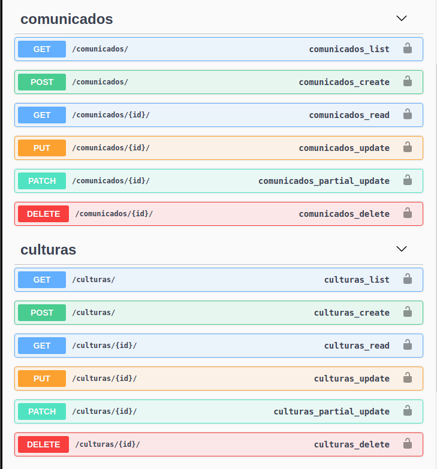

# Desafio Softfocus

## Web Developer Python - Pleno

O Proagro Fácil é um sistema da Softfocus que facilita o gerenciamento de Proagro (Programa de Garantia da Atividade
Agropecuária). O Proagro é um programa administrado pelo Banco Central do Brasil, que visa exonerar o produtor rural de
obrigações financeiras relativas a operações de crédito, em casos de ocorrência de perdas nas lavouras. Estas perdas
podem ser ocasionadas por fenômenos naturais, como chuva excessiva, geada, granizo, etc.

No Proagro Fácil, uma das principais etapas para a solicitação de Proagro é o cadastro da comunicação da perda ocorrida,
onde o analista de Proagro irá informar os dados sobre o produtor rural, sobre a lavoura e sobre o evento que provocou a
perda. É muito importante que essas informações sejam preenchidas corretamente para que o produtor tenha o benefício
aprovado.

Neste desafio, você irá criar uma versão simplificada da comunicação de perda.

## Critérios essenciais

1. :heavy_check_mark: A solução deve ser desenvolvida em Python (utilize o framework de sua preferência);
2. A solução deve possibilitar o cadastro, visualização, atualização e exclusão de uma comunicação de perda;
3. Crie a interface Web com o framework que desejar;
4. Os dados devem ser salvos em um dos banco de dados: Postgres, MySQL, MongoDB ou Firebase;
5. A comunicação de perda deve ter os seguintes campos:

   a. Nome do produtor rural;

   b. E-mail do produtor rural;

   c. CPF do produtor rural;

   d. Localização da lavoura (latitude e longitude);

   e. Tipo da lavoura (milho, soja, trigo, feijão, etc);

   f. Data da colheita;

   g. Evento ocorrido, sendo os eventos possíveis:

   - i. CHUVA EXCESSIVA

   - ii. GEADA
   - iii. GRANIZO
   - iv. SECA
   - v. VENDAVAL
   - vi. RAIO

6. Quando o analista estiver cadastrando uma nova comunicação de perda, queremos garantir a veracidade do evento
   informado. Por isso, caso já exista um cadastro no banco de dados, com mesma data, cuja localização esteja em um raio
   de 10km da localização da nova comunicação de perda e for um evento divergente do que já consta no banco de dados, o
   analista deverá ser informado;

7. O projeto deverá conter validações para que o CPF e e-mail informados sejam válidos (feito em Javascript);

8. Deve ser possível realizar a busca de uma comunicação de perda pelo CPF do produtor (front-end);

9. O projeto deverá ser disponibilizado em repositório online, como Github, Gitlab, etc;

10. O repositório deve conter um arquivo README explicando como utilizar o projeto.
11. Implementar testes automatizados;

## Critérios opcionais

- Utilizar um framework front-end (Angular, React, Vue, Ember JS, etc);
- Deixar a comunicação de perda intuitiva e com uma interface agradável também será um diferencial (utilização de CSS);
- Fazer deploy do projeto (ex.: Heroku, Surge.sh, Pythonanywhere, AWS, etc)
  e disponibilizar a URL para acesso;
- Disponibilizar a aplicação em forma de API para consulta e manipulação das comunicações de perda;
- Disponibilizar a documentação da API (Swagger, Apiary, Document360, etc);
- Qualquer funcionalidade extra será bem-vinda.

# Detalhes:

## POSTGIS

### GeoDjango

[GeoDjango requisitos](https://docs.djangoproject.com/pt-br/3.2/ref/contrib/gis/install/geolibs/)

`sudo apt-get install binutils libproj-dev gdal-bin`

```shell
python -m venv venv
python3 -m venv venv
source venv/bin/activate
pip install -r requirements.txt -U

```

### Testes

 Proagro    
 Api  
 Conta

[(coverage-badge)](https://github.com/dbrgn/coverage-badge)

```shell
python manage.py test
pip install coverage
coverage run --source=proagro,api,conta manage.py test
coverage report
```

# Orientações

### Testes/Homologação

Requer `docker + docker-compose` e a porta `80` disponível

```shell
cp .env.example .env
cp .env.prod.db.example .env.prod.db
cp .env.prod.example .env.prod
docker-compose up -d
docker-compose exec web python manage.py migrate
docker-compose exec web python manage.py createsuperuser
docker-compose exec web python manage.py loaddata fixtures/proagro.json
```

Acesse: [http://localhost](http://localhost)

### Api



## DumpData

`python manage.py dumpdata --exclude=contenttypes --exclude=auth.Permission > fixtures/all.json`

`python manage.py dumpdata --exclude=contenttypes --exclude=auth.Permission > /home/julioriffel/Dropbox/devs/adapar/adapar_rede/all.json`

## Ref

Template: https://github.com/creativetimofficial/argon-dashboard-django